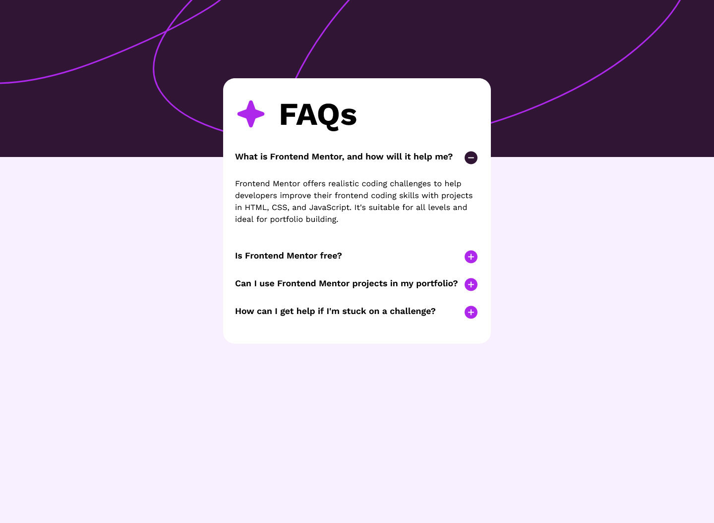

# Frontend Mentor - FAQ accordion solution

This is a solution to the [FAQ accordion challenge on Frontend Mentor](https://www.frontendmentor.io/challenges/faq-accordion-wyfFdeBwBz). Frontend Mentor challenges help you improve your coding skills by building realistic projects. 

## Table of contents

- [Overview](#overview)
  - [The challenge](#the-challenge)
  - [Screenshot](#screenshot)
  - [Links](#links)
- [My process](#my-process)
  - [Built with](#built-with)
  - [What I learned](#what-i-learned)
- [Author](#author)

## Overview

### The challenge

Users should be able to:

- Hide/Show the answer to a question when the question is clicked
- Navigate the questions and hide/show answers using keyboard navigation alone
- View the optimal layout for the interface depending on their device's screen size
- See hover and focus states for all interactive elements on the page

### Screenshot



### Links

- Solution URL: [faq-accordion-solution](https://github.com/phangtono/phangtono-revision-faq-accordion)
- Live Site URL: [faq-accordion-live-site](https://clinquant-monstera-75309e.netlify.app/)

## My process

### Built with

- HTML5
- Javascript
- CSS
- Flexbox
- Grid
- pseudo-element :after

### What I learned

Revision From : https://www.frontendmentor.io/solutions/faq-accordion-using-grid-and-flexbox-0TqFbMwANx

Thank you for the valuable feedback from mentor @grace-snow (https://www.frontendmentor.io/profile/grace-snow). I've implemented some improvements based on the suggestions. 

If previously I used @import, this time I used the link tag in the html head. (for better performance).

```html
  <link rel="preconnect" href="https://fonts.googleapis.com">
  <link rel="preconnect" href="https://fonts.gstatic.com" crossorigin>
  <link href="https://fonts.googleapis.com/css2?family=Work+Sans:wght@400;600;700&display=swap" rel="stylesheet">
```

In this implementation, I use landmarks, empty string for alt on the decorative image. and use the picture tag for the background image. (for better performance)

```html
<header>
    <picture>
        <source media="(max-width:1440px)" srcset="assets/images/background-pattern-desktop.svg">
        <source media="(max-width:810px)" srcset="assets/images/background-pattern-mobile.svg">
        
    </picture>
</header>
```

For layout I still use a grid. the values in grid-template-columns, grid-template-rows are slightly different from before, resulting in a smoother response.

```css
body {
    background-color: var(--clr-light-pink);
    min-height: 100vh;
    height: 100%;
    display: grid;
    grid-template-columns: 1fr minmax(auto,720px) 1fr;
    grid-template-rows: 10vh 15vh min-content;
}

header{
    background-color: var(--clr-dark-purple);
    grid-column: 1 / -1;
    grid-row: 1 / 3;
}

main{
    grid-column: 2 / 3;
    grid-row: 2 / 4;
}

footer{
    font-size: 68.75%; 
    text-align: center;
    padding: 1rem;
    grid-column: 2 / 3;
    grid-row: -1 / span 1;
}
```

What's interesting about this implementation? if previously I used an empty div (I also used the img tag), this time I used the :after pseudo-element, with the content property. the results are really cool.

```css
.card-faq__ques::after{
    width: 2rem;
    height: 2rem;
    content: url('assets/images/icon-plus.svg');
}

.show .card-faq__ques::after{
    content: url('assets/images/icon-minus.svg');
}
```

The following is a JavaScript script that has been adjusted to accommodate the HTML changes.

```js
document.addEventListener('DOMContentLoaded', function () {
    const faqItems = document.querySelectorAll('.card-faq__ques-list-item');

    faqItems.forEach(function (item) {
        item.addEventListener('click', function () {
            this.classList.toggle('show');

        });
    });
});
```

## Author

- Frontend Mentor - [@phangtono](https://www.frontendmentor.io/profile/phangtono)