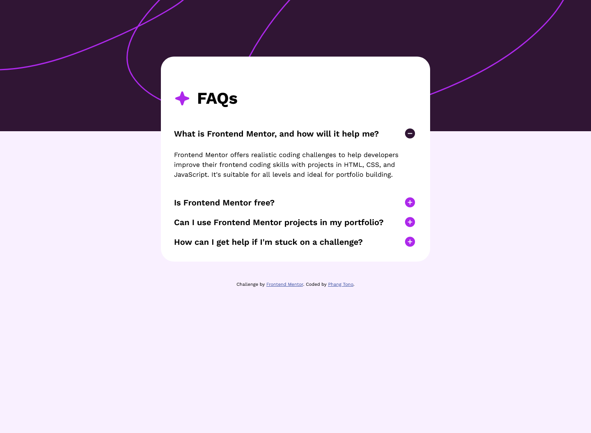

# Frontend Mentor - FAQ accordion solution

This is a solution to the [FAQ accordion challenge on Frontend Mentor](https://www.frontendmentor.io/challenges/faq-accordion-wyfFdeBwBz). Frontend Mentor challenges help you improve your coding skills by building realistic projects. 

## Table of contents

- [Overview](#overview)
  - [The challenge](#the-challenge)
  - [Screenshot](#screenshot)
  - [Links](#links)
- [My process](#my-process)
  - [Built with](#built-with)
  - [What I learned](#what-i-learned)
- [Author](#author)

## Overview

### The challenge

Users should be able to:

- Hide/Show the answer to a question when the question is clicked
- Navigate the questions and hide/show answers using keyboard navigation alone
- View the optimal layout for the interface depending on their device's screen size
- See hover and focus states for all interactive elements on the page

### Screenshot



### Links

- Solution URL: [faq-accordion-solution](https://github.com/phangtono/faq-accordion)
- Live Site URL: [faq-accordion-live-site](https://poetic-croquembouche-e62d0a.netlify.app/)

## My process

### Built with

- HTML5
- Javascript
- CSS
- Flexbox
- Grid

### What I learned

This script runs when the click event occurs, or when we press enter while the focus is on the link a href.

```js

const listItems = document.querySelectorAll('#mylist li');

listItems.forEach(item => {
    item.addEventListener('click', function() {
        listItems.forEach(li => {
            li.classList.remove('checked');
        });

        this.classList.add('checked');
    });
});

```
To get the layout, I used a grid. and to make it responsive, I use minmax
```css
.wrapper{
    display: grid;
    grid-template-columns: minmax(1rem,auto) minmax(340px,540px) minmax(1rem,auto);
    grid-template-rows: 15% 15% min-content auto;
    height: 100%;
}
.image {
    background-color: var(--clr-dark-purple);
    background-image: url('assets/images/background-pattern-desktop.svg');
    background-position: center center;
    background-repeat: no-repeat;
    background-size: cover;
    grid-column: 1 / -1;
    grid-row: 1 / 3;
}
.faq{
    --gap : 1.5rem;

    background-color: var(--clr-white);
    grid-column: 2 / 3;
    grid-row: 2 / 4;

    border-radius: var(--gap);
    padding: var(--gap);

}
```
I use flexbox to get a layout like the design.
```css
.faq .title {
    display: flex;
    gap: var(--gap);
    align-items: center;
    justify-items: start;
    font-weight: var(--fw--700);
    font-size: var(--fs--700);
}
```

## Author

- Frontend Mentor - [@phangtono](https://www.frontendmentor.io/profile/phangtono)
"# faq-accordion" 
"# faq-accordion-rev1" 
"# phangtono-revision-faq-accordion" 
